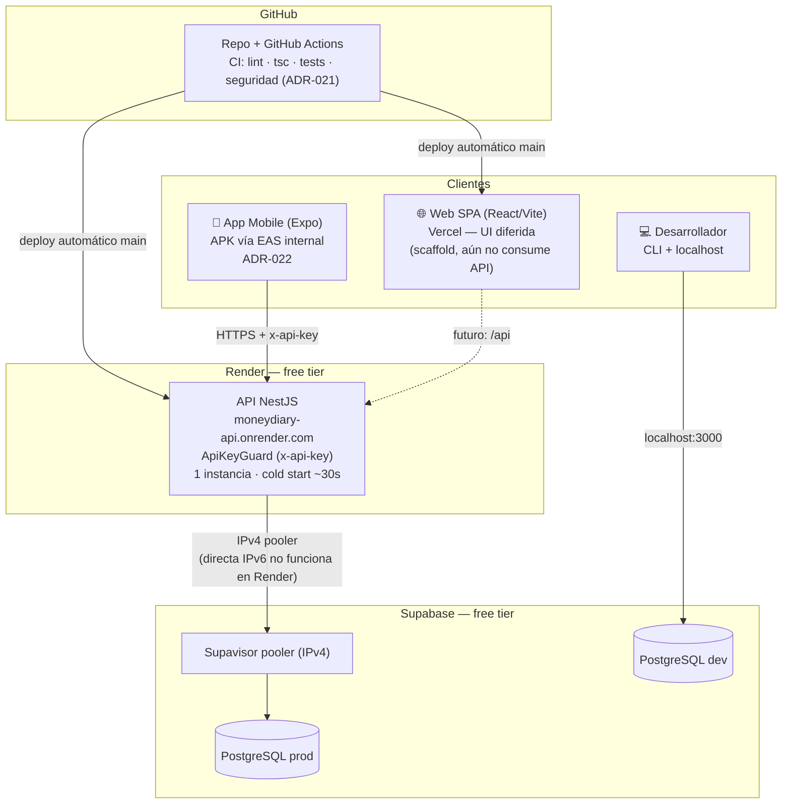
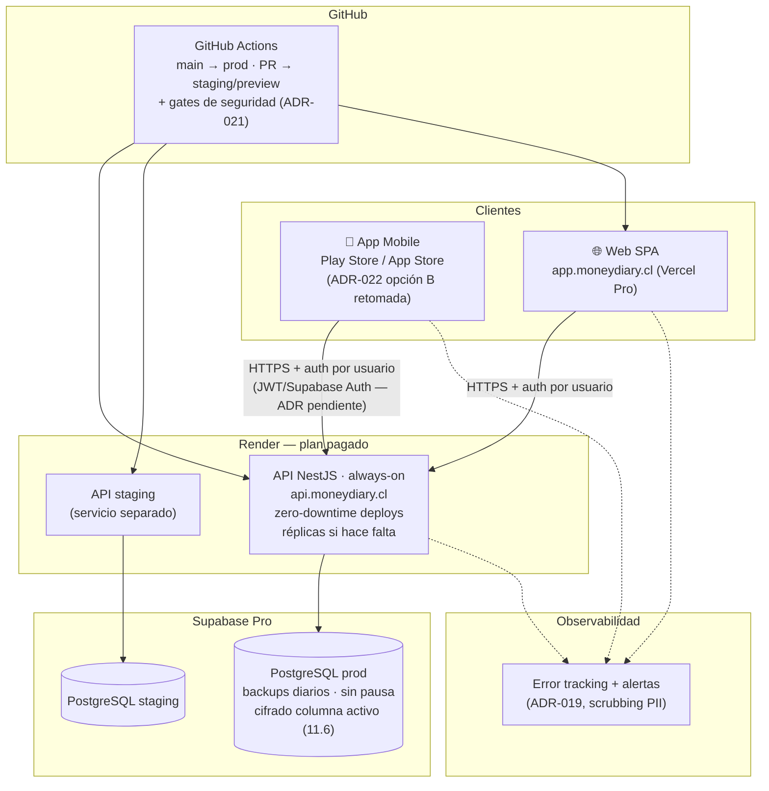

---
tags:
  - adr
  - fase-diseño
  - hosting
  - devops
  - topologia
proyecto: MoneyDiary
estado: 🔵 En discusión
fecha_creacion: 2026-07-16
fecha_actualizacion: 2026-07-16
---

# ADR-023 — Topología de Despliegue: actual (PaaS free tier, mono-usuario) y evolución hacia clientes

## Estado

🔵 **En discusión.** La **topología actual** se documenta como hecho (ya está en producción). La **topología futura** se propone como dirección de trabajo — *PaaS escalado sobre los mismos proveedores* — pero la decisión final queda diferida hasta que se activen los gatillos de la sección Gatillos. No bloquea el MVP ni el Máster.

---

## Contexto

Las decisiones de despliegue existen repartidas en varios ADRs: ADR-004 Hosting eligió los proveedores (Vercel + Render + GitHub Actions), ADR-002 Base de Datos fijó Supabase, y ADR-022 Ruta de Despliegue Mobile resolvió la distribución mobile para la demo del Máster. Sin embargo, **ningún documento describe la topología completa como sistema**: qué piezas corren dónde, cómo se conectan, qué límites tiene el conjunto y —sobre todo— **qué debe cambiar cuando el producto pase de "demo del Máster para un usuario fijo" a "producto con clientes reales"**.

Ese vacío importa ahora porque:

- **Ya hay producción real:** la API vive en Render (`https://moneydiary-api.onrender.com`), protegida por `ApiKeyGuard`, y la app mobile instalada por evaluadores la consume por HTTPS (Sprint 3, Tracks A y B ✅).
- **La topología actual tiene supuestos que no sobreviven a clientes:** usuario único fijo (Tarea 0), API key compartida embebida en el build, free tiers con cold start y sin garantías, cifrado de columna diferido como riesgo aceptado (`docs/mobile-launch-runbook.md`).
- **Conviene decidir la dirección antes de necesitarla:** saber hoy que la evolución es "escalar el PaaS" (y no "migrar a AWS") evita sobre-ingeniería y permite que cada decisión intermedia (auth, monitoring, staging) apunte al mismo destino.

---

## Topología actual (hecho — julio 2026)

### Diagrama

### Componentes y estado

| Pieza | Dónde corre | Plan | Notas |
|---|---|---|---|
| API NestJS | Render (web service) | Free | 1 instancia; duerme a los 15 min sin tráfico, cold start ~30 s; `ApiKeyGuard` global fail-closed, health check `@Public()` |
| PostgreSQL | Supabase (2 proyectos: dev/prod) | Free | Conexión desde Render **solo vía pooler IPv4** (Supavisor); la conexión directa IPv6 no rutea desde Render |
| Web SPA | Vercel | Hobby (free) | Solo scaffold; la UI que consume `/api/resumen` está diferida (pivote mobile Sprint 3) |
| App mobile | Dispositivo del usuario | EAS free (15 builds/mes) | APK firmado por EAS, distribución interna vía URL/QR (ADR-022 Ruta de Despliegue Mobile); stores en trámite (Track C) |
| CI/CD | GitHub Actions | Free | Lint + tsc + tests + capas de seguridad de ADR-021 Análisis de Seguridad en el Pipeline; deploy automático a Render/Vercel en `main` |
| Secretos | Dashboards | — | `API_KEY`/`DATABASE_URL`/`DIRECT_URL` en Render (`sync:false`); key mobile en EAS Secrets; CI en GitHub Secrets. Nada en el repo (RNF-SEC-005) |

### Límites conocidos de esta topología

- **Mono-usuario por diseño** (Tarea 0 Sprint 2): no hay auth de usuario final; la API key es un **secreto compartido** que autentica *al cliente*, no *a la persona*.
- **Cold start ~30 s** en la primera request tras inactividad — aceptable para demo, inaceptable para clientes.
- **Sin SLA, sin réplicas, sin backups garantizados:** el free tier de Supabase no incluye backups diarios y puede pausar proyectos inactivos.
- **Cifrado de columna diferido** (`NoOpCryptoService`, CA-03 abierto): riesgo aceptado porque `/api/resumen` no expone PII; gatillo duro documentado en el runbook.
- **Sin observabilidad:** errores solo en logs de Render (ADR-019 Tracking y Monitoring en discusión).
- **Sin entorno de staging del backend:** solo local → producción.

---

## Topología futura (propuesta — cuando lleguen clientes)

### Dirección propuesta: PaaS escalado ✅

**Mantener los mismos proveedores (Render + Supabase + Vercel + EAS) subiendo a planes pagados y agregando las piezas que hoy faltan (staging, dominio, observabilidad), en lugar de migrar de plataforma.**

**¿Por qué esta dirección y no una migración?**

- **El cuello de botella no es la plataforma, es el plan.** Todos los límites de la tabla anterior (cold start, backups, pausas, 1 instancia) se resuelven pagando, sin tocar código ni arquitectura.
- **Coherencia con ADR-005 Monolito-Modular-Clean-Architecture:** un monolito modular con Clean Architecture no necesita orquestación; una instancia always-on con réplicas opcionales lo sirve bien hasta miles de usuarios.
- **Un solo desarrollador:** el costo operativo de Kubernetes/IaC lo paga el equipo, no la plataforma. Aquí el "equipo" es una persona con un Máster que cerrar.
- **Todo lo aprendido transfiere:** `render.yaml`, GitHub Actions, EAS y la disciplina de secretos son idénticos en free y en pago. No es una segunda topología, es la misma con más recursos.

### Diagrama objetivo

### Qué cambia, pieza por pieza

| Pieza | Hoy | Con clientes | Costo ref. (2026) |
|---|---|---|---|
| API | Render free, 1 instancia, cold start | Instancia **Starter** (512 MB) always-on, zero-downtime; escalar vertical (Standard) u horizontal (réplicas) según carga | ~USD 7/mes la instancia Starter |
| BD | Supabase free (pausable, sin backups diarios) | **Supabase Pro**: backups diarios (7 días), sin pausa, 8 GB, soporte; PITR como add-on si el RPO lo exige | ~USD 25/mes + uso |
| Web | Vercel Hobby | **Vercel Pro** — el plan Hobby **prohíbe uso comercial**, así que llegar a clientes lo exige por licencia, no solo por recursos | ~USD 20/mes |
| Mobile | APK interno (demo) | Stores reales: Play (closed test 12×14 ya conocido) + Apple Developer (USD 99/año) | Ver ADR-022 Ruta de Despliegue Mobile |
| Entornos | local → prod | local → **staging** (servicio Render + proyecto Supabase staging, datos sintéticos) → prod | Instancia staging puede ser free |
| Dominio | Subdominios del proveedor | Dominio propio (`moneydiary.cl` o similar) + TLS gestionado por Vercel/Render | ~USD 15/año |
| Observabilidad | Logs de Render | Cerrar ADR-019 Tracking y Monitoring (Sentry SDKs + backend compatible, scrubbing PII obligatorio) | Free tier inicial |

**Orden de magnitud del costo base: ~USD 50–60/mes** (más el año de Apple). Es el precio de no operar infraestructura — comparar contra las horas/mes que costaría lo mismo autogestionado.

### Gatillos — qué debe pasar antes de clientes

Estos son **prerrequisitos, no opcionales**. La topología pagada sin esto solo escala los problemas:

1. **Autenticación por usuario final** (ADR pendiente desde ADR-010 App Mobile): la API key compartida deja de ser el mecanismo de acceso de clientes — pasa a ser, a lo sumo, una defensa perimetral adicional. El aislamiento estructural por `userId` (RNF-SEC-006) ya existe en los repositorios; falta la identidad real que lo alimente.
2. **Cifrado de columna real (11.6, ADR-013 Cifrado de Datos en Reposo):** el riesgo aceptado del runbook tiene gatillo explícito — cerrar 11.6 **antes** de exponer descripciones/nombre/RUT. Clientes reales lo disparan sí o sí.
3. **Observabilidad operativa:** cerrar ADR-019. No se puede dar servicio a terceros ciegos a los errores.
4. **Staging:** ningún cambio llega a datos de clientes sin pasar por un entorno intermedio (hoy el gate `ALLOW_DESTRUCTIVE_DB=1` protege, pero no reemplaza un staging).
5. **Rate limiting y hardening del borde** (throttling en NestJS o en el proveedor): una API financiera pública sin límite de tasa es superficie de abuso.

### Alternativas descartadas (por ahora)

- **Contenedores (Docker + Fly.io / Cloud Run / Railway):** portabilidad y control de runtime, pero agrega una capa (imágenes, registries, health checks propios) que Render ya abstrae, sin resolver ningún problema que hoy exista. *Revisitar si:* Render encarece desproporcionadamente, o se necesita región Sudamérica por latencia.
- **Cloud grande + IaC (AWS/GCP + Terraform):** máximo control y valor de aprendizaje, pero el costo de operación (VPC, IAM, parches, facturación variable) es incompatible con un solo desarrollador y contradice la razón por la que ADR-004 Hosting eligió PaaS. *Revisitar si:* requisitos de compliance/residencia de datos (p. ej. exigencias CMF si el producto se regula) obligan a infraestructura dedicada, o la factura PaaS supera de forma sostenida el equivalente a ~USD 200–300/mes.

---

## Seguridad

- **La API key compartida es aceptable solo en la topología actual** (audiencia controlada: desarrollador + evaluadores). En la futura, la identidad es por usuario y los tokens viven en `expo-secure-store` / manejo seguro en web (ADR-010 App Mobile, ADR-012 packages api-client).
- **Secretos siempre fuera del repo** en ambas topologías: dashboards de Render/Vercel, GitHub Secrets, EAS Secrets (RNF-SEC-005, control I-05 del Threat Model — App de Finanzas Personales).
- **Staging con datos sintéticos, nunca copias de prod:** coherente con la regla de ADR-021 Análisis de Seguridad en el Pipeline (DAST nunca contra Supabase real) y con ADR-013 Cifrado de Datos en Reposo.
- **El scrubbing de PII/montos** ya implementado en el backend se extiende a la capa de observabilidad (`beforeSend` de ADR-019) antes de encender monitoring en producción.
- **Backups con cifrado en reposo** (Supabase Pro) + verificación periódica de restauración: un backup no probado no es un backup.

---

## Consecuencias

**Positivas:**
- Queda **una sola fuente de verdad de la topología completa** (este ADR + diagramas), en lugar de reconstruirla desde ADR-002/004/022.
- La dirección "PaaS escalado" **desactiva la tentación de sobre-ingeniería**: ninguna US intermedia necesita preparar Kubernetes ni multi-cloud.
- Los **gatillos convierten "estar listo para clientes" en una checklist verificable** (auth, 11.6, ADR-019, staging, rate limiting) en vez de una sensación.
- El costo objetivo (~USD 50–60/mes) es conocido de antemano y compatible con un proyecto que recién valida mercado.

**A tener en cuenta:**
- **Lock-in suave** a Render/Supabase/Vercel: mitigado porque la app es un monolito Node estándar + PostgreSQL estándar — migrar es posible, solo no es gratis.
- Los **precios citados son referenciales a julio 2026** y cambian; revalidar al activar la decisión.
- Render cobra el workspace por separado del cómputo en algunos planes — revisar la estructura de facturación vigente al contratar.
- Este ADR **no decide el mecanismo de auth** (Supabase Auth vs JWT propio vs otro): esa es la decisión pendiente más grande del camino a clientes y merece su propio ADR.

---

## No incluido en este ADR (decisiones futuras)

- **Mecanismo de autenticación de usuario final** (ADR pendiente — el gatillo #1).
- **Elección final del backend de observabilidad** (ADR-019 Tracking y Monitoring, en discusión).
- **Multi-región / CDN avanzado / colas y workers:** no hay requisito que lo justifique aún.
- **Compliance regulatorio chileno (CMF / Ley 21.719 de datos personales):** se estudia cuando haya clientes reales en el horizonte; puede alterar la elección de proveedores por residencia de datos.

---

## Referencias

- ADR-002 Base de Datos — Supabase, dos proyectos dev/prod
- ADR-004 Hosting — proveedores elegidos (Vercel + Render + GitHub Actions); este ADR lo extiende, no lo reemplaza
- ADR-005 Monolito-Modular-Clean-Architecture — por qué el monolito no necesita orquestación
- ADR-013 Cifrado de Datos en Reposo — gatillo 11.6 antes de exponer PII
- ADR-019 Tracking y Monitoring — observabilidad pendiente (gatillo #3)
- ADR-021 Análisis de Seguridad en el Pipeline — gates de CI que aplican igual en ambas topologías
- ADR-022 Ruta de Despliegue Mobile — distribución mobile actual y ruta a stores
- Threat Model — App de Finanzas Personales — control I-05 (secretos)
- [Render — Pricing](https://render.com/pricing)
- [Supabase — Pricing](https://supabase.com/pricing)
- [Vercel — Fair Use / Hobby plan (uso no comercial)](https://vercel.com/docs/limits/fair-use-guidelines)

---

*Fecha de apertura de la discusión: 2026-07-16*
